<div align="center">

# 纸上奇遇
### Photo Paper Story

**让照片里的一个细节，走进纸上的另一个世界。**

摄影 · 纸张 · 手绘 · 一点奇思妙想

[看作品](#作品画廊) · [开始创作](#开始创作) · [安装 Skill](#安装-skill)

</div>


<p align="center"><em>灯光成了河，纸船载着一个小小的愿望。<br>本次新生成的封面作品 · 无字版</em></p>

一件毛衣，可以藏着电车的下一站。树的影子，可以变成冬天的围巾。一座山，也可以折起来带走。

**纸上奇遇**将写实摄影中的一个元素延伸到米白纸面，变成一个有动作、有情绪的小故事。这个 Codex Skill 帮你把一句随口的想法、一张照片，甚至“我还没有想法”，变成可执行的图像创作请求。

## 作品画廊

下面的 13 张图片由用户提供，用户说明它们由同一提示词生成。Skill 的风格规则根据这些图片提炼，原始提示词尚未提供。封面是本次另外生成的新作。

### 城市里，藏着另一条路

<table>
<tr><td width="33%"><a href="docs/images/last-train.jpg">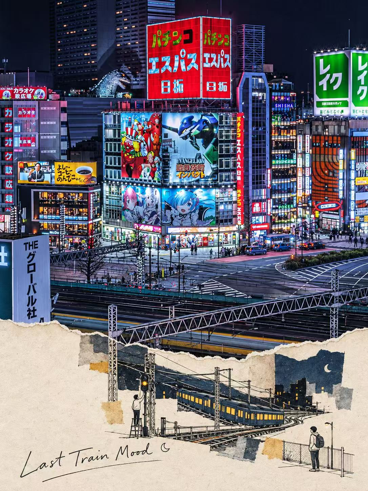</a></td><td width="33%"><a href="docs/images/catching-signal.jpg">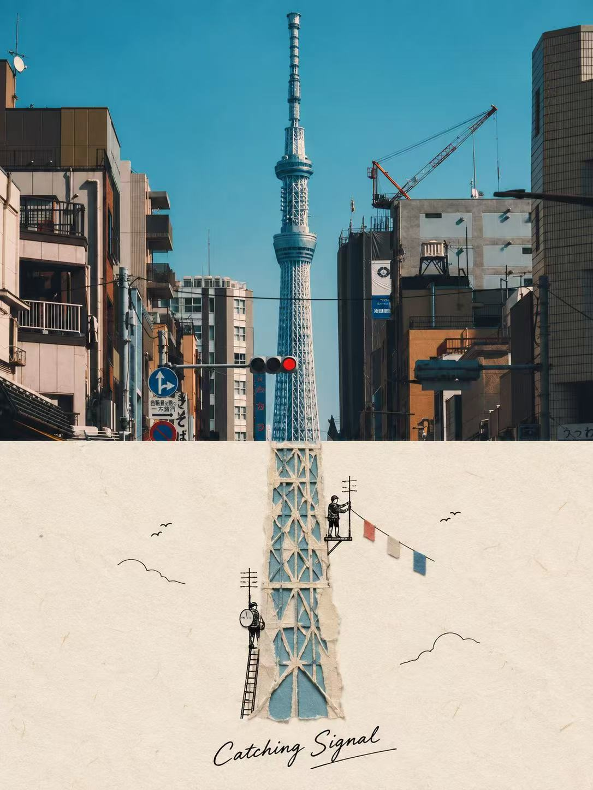</a></td><td width="33%"><a href="docs/images/open-late.jpg">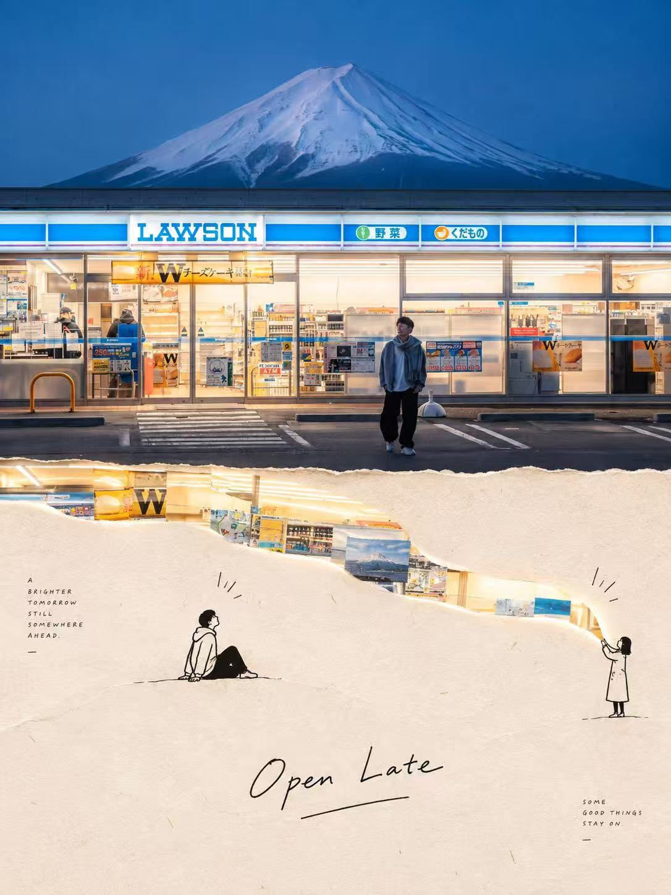</a></td></tr>
<tr><td align="center">末班车的心情</td><td align="center">寻找信号</td><td align="center">好事还亮着灯</td></tr>
</table>

### 日常里，发生一点小小的叛逃

<table>
<tr><td width="33%"><a href="docs/images/cozy-stop.jpg">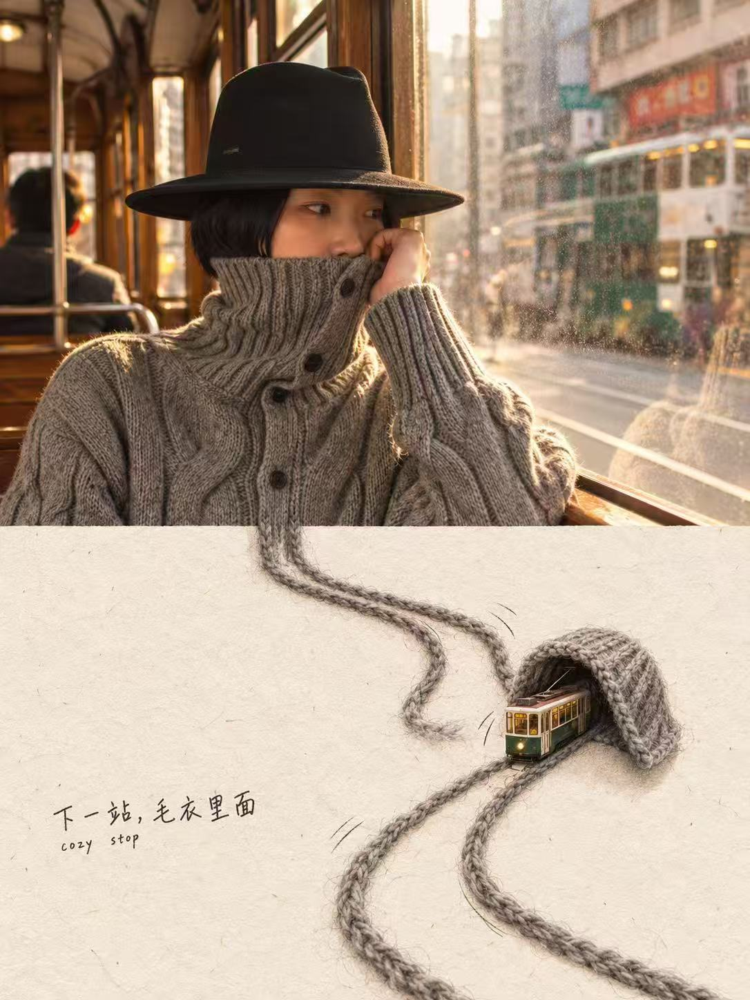</a></td><td width="33%"><a href="docs/images/five-more-minutes.jpg">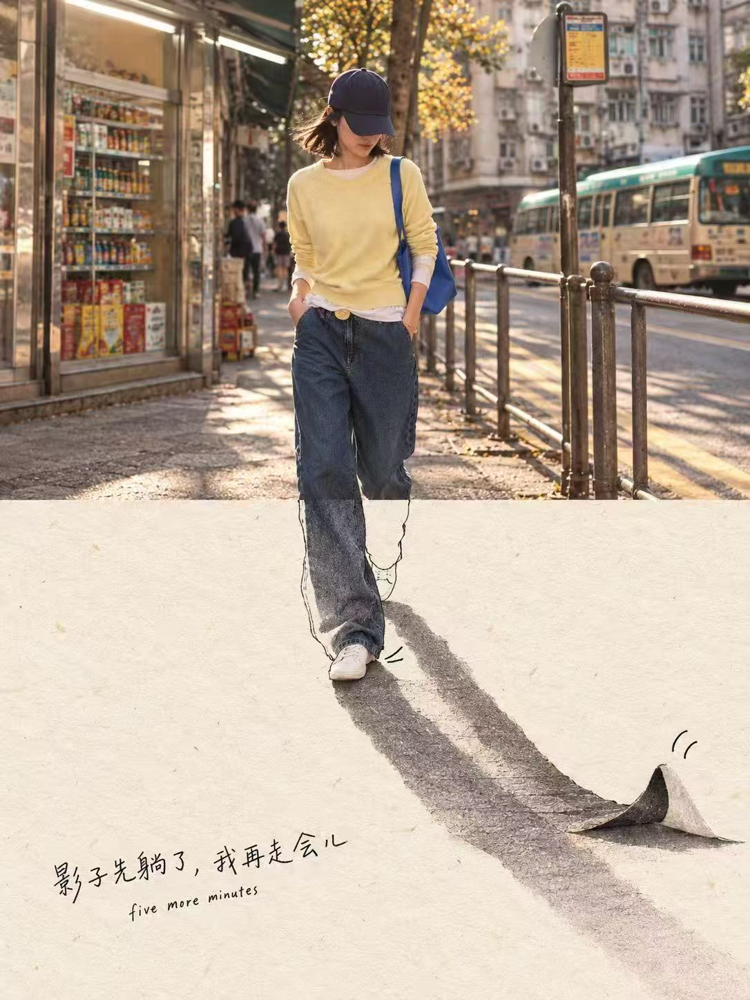</a></td><td width="33%"><a href="docs/images/off-duty.jpg"></a></td></tr>
<tr><td align="center">下一站，毛衣里面</td><td align="center">影子先躺了</td><td align="center">找到下班键</td></tr>
</table>

### 风景里，多一个温柔的办法

<table>
<tr><td width="33%"><a href="docs/images/branch-office.jpg">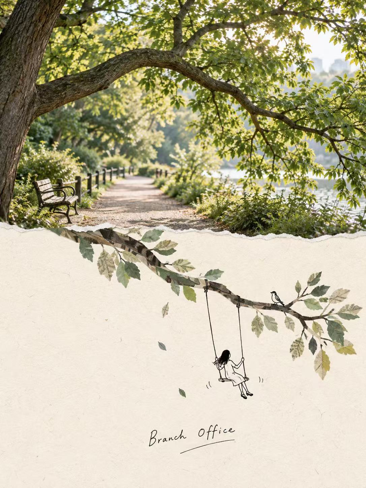</a></td><td width="33%"><a href="docs/images/pocket-mountain.jpg">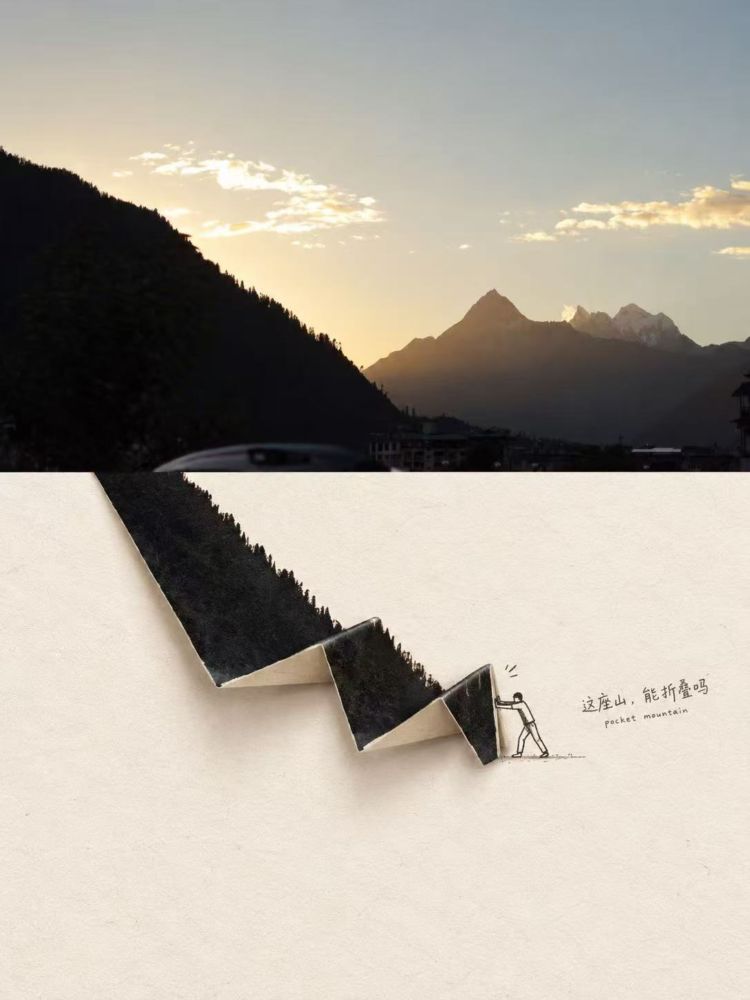</a></td><td width="33%"><a href="docs/images/working-on-it.jpg">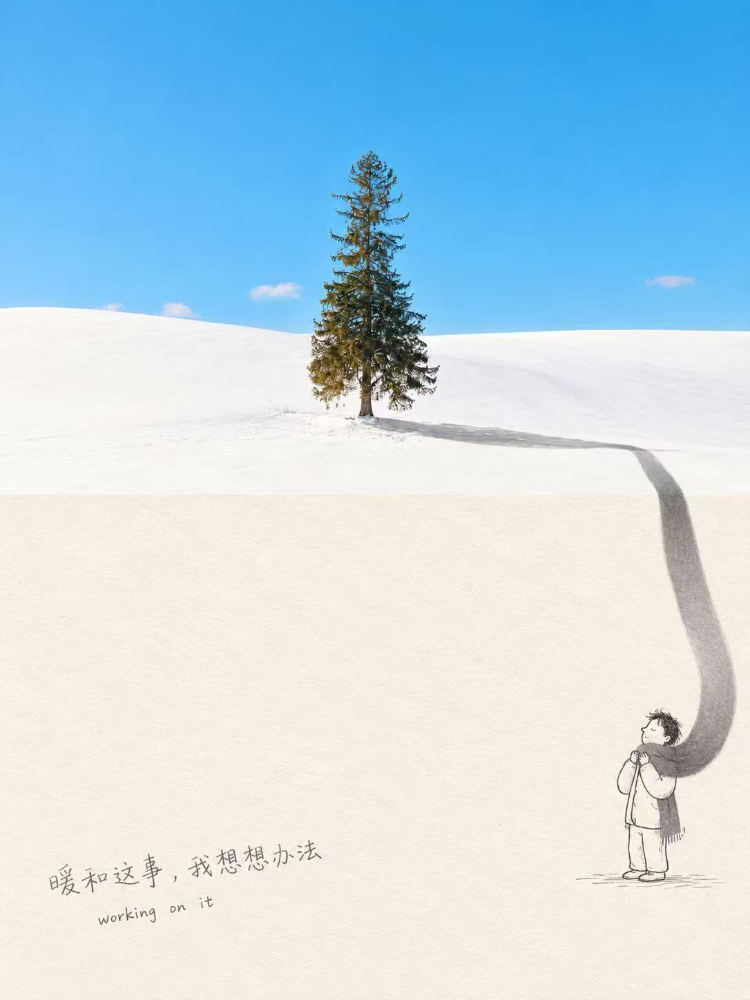</a></td></tr>
<tr><td align="center">树枝办公室</td><td align="center">把山折起来</td><td align="center">把影子围暖</td></tr>
</table>

<details>
<summary><strong>再看四个纸上的小故事 →</strong></summary>

<table>
<tr><td width="50%"><a href="docs/images/quite-a-catch.jpg">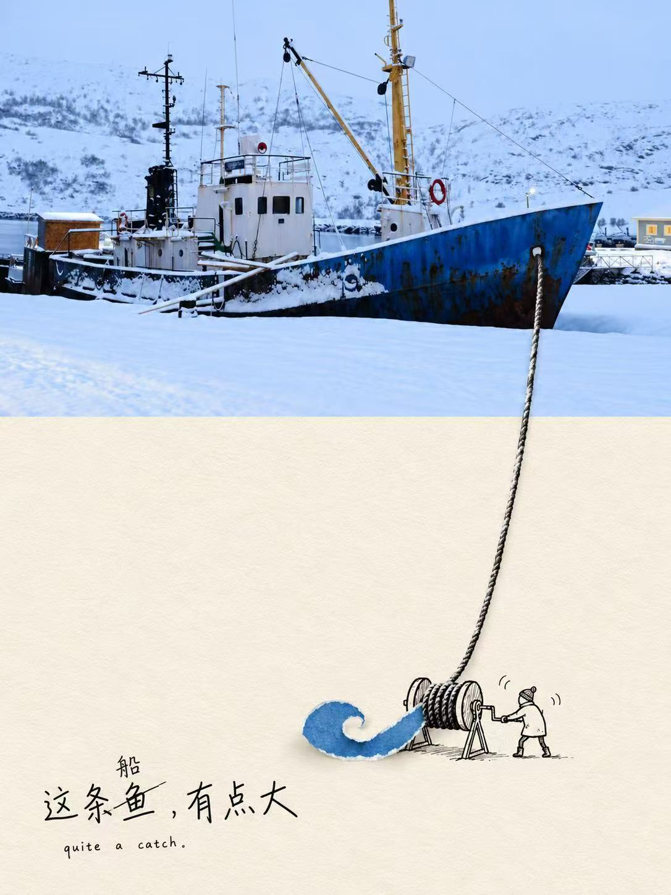</a></td><td width="50%"><a href="docs/images/snow-day.jpg">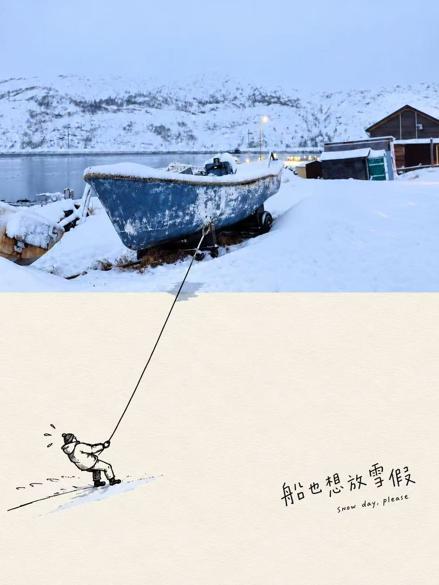</a></td></tr>
<tr><td align="center">这条船，有点大</td><td align="center">船也想放雪假</td></tr>
</table>

<table>
<tr><td width="50%"><a href="docs/images/carry-on-sunset.jpg">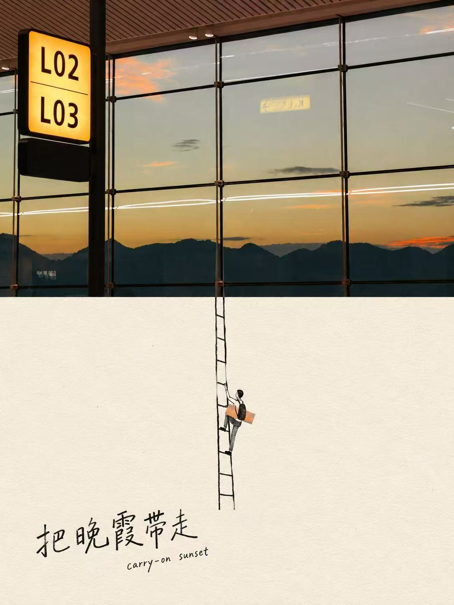</a></td><td width="50%"><a href="docs/images/still-waiting.jpg">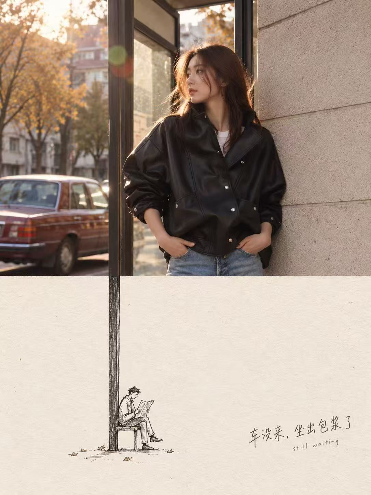</a></td></tr>
<tr><td align="center">把晚霞带走</td><td align="center">车没来，坐出包浆了</td></tr>
</table>

</details>

点击作品即可查看完整图片。图片来源与生成记录见 [作品记录](docs/artwork-ledger.md)。

## 一个细节，两种世界

这套风格的关键，是**让照片里的元素跨过边界，在纸上获得另一种用途**。

| 照片里的细节 | 纸上的奇遇 |
| --- | --- |
| 毛衣纱线 | 电车轨道与编织隧道 |
| 雪地树影 | 小人物的围巾 |
| 窗框竖线 | 通往晚霞的梯子 |
| 键盘按键 | 下班滑梯 |

写实摄影、有纤维感的米白纸面、细黑线小人物和大量留白，共同衬托这个视觉巧思。

## 开始创作

### ① 没有想法，也能开始

```text
$photo-paper-story 我没有任何想法，给我一些建议。
```

先得到约四个具体创意，再选一个生成。想让它自主决定，就补一句“你帮我决定，直接生成”。

### ② 随口说说，变成画面

```text
$photo-paper-story 我想要一棵雪地里的树，小人把树影当围巾，
温暖又有点幽默，不要文字。
```

无需编写专业提示词。可以使用聊天界面的语音转文字；直接音频输入取决于环境是否支持音频理解或转写。

### ③ 上传照片，发现它的另一种可能

附上照片，再输入：

```text
$photo-paper-story 把这张照片改成纸上奇遇风格，
保留人物的脸和衣服，让照片里的一个元素延伸到纸面。
```

同时上传原图和风格参考图时，请说明各自用途。多张照片可以分别生成，也可以明确要求合成。

生成后还可以继续说：“人物再小一点”“换一个更有趣的连接”“去掉文字”。

## 安装 Skill

下载本仓库，将完整的 [photo-paper-story](photo-paper-story/) 文件夹放入 `~/.codex/skills/`。配置了 `CODEX_HOME` 时，放入其下的 `skills/` 目录。保留文件夹结构，随后在新聊天中调用 `$photo-paper-story`。

只安装 Skill 文件夹即可，无需下载画廊图片。

## 能力与文件

- 默认生成一张 3:4 竖版图；支持修改比例、情绪、文案和主体保留项。
- 有可用图像工具时生成或编辑图片；没有时提供完整提示词，并说明图片尚未生成。
- 不绑定图像供应商，不包含凭证，不自动发布或上传作品。
- 参考作品不代表本 Skill 已完成三种模式实测；不保证逐字还原原提示词或复现相同结果。

```text
photo-paper-story/           # 可独立安装的 Skill
├── SKILL.md
├── agents/openai.yaml
└── references/
    ├── style-guide.md
    └── examples.md
docs/
├── images/                 # 仓库展示作品
└── artwork-ledger.md       # 来源与生成记录
```

<p align="center"><strong>从一张照片开始，给日常留一个想象的出口。</strong></p>
